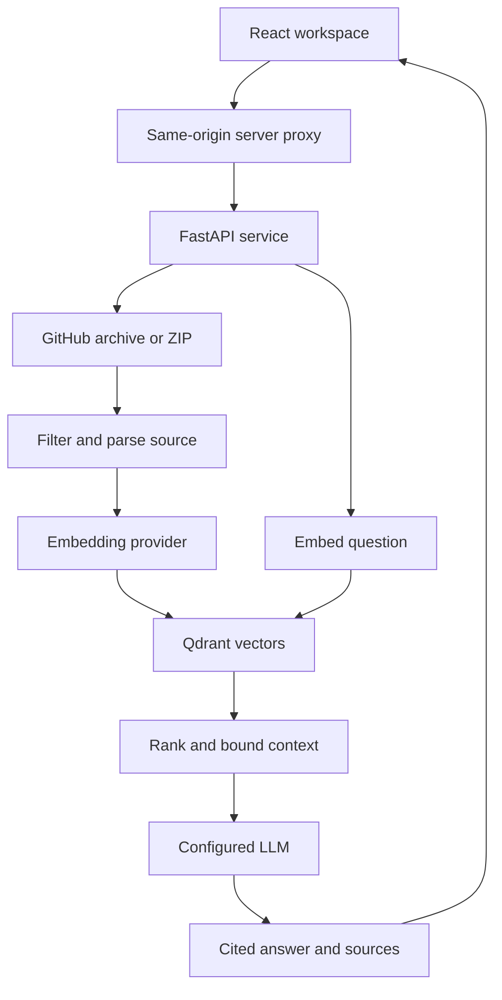

# CodeAtlas

**Understand a repository through function-level retrieval and source evidence.**

CodeAtlas is a hackathon prototype for the Codebase RAG Assistant challenge. It pairs a React/TypeScript workspace with a Python FastAPI service, AST parsing, real embeddings, Qdrant vector retrieval, and cited LLM answers.

## Current state

The interface and Python pipeline are implemented. The hosted interface opens a **source preview**, generated by the production parser from the included sample repository. It is explicitly not an indexed AI demo. No answers, embeddings, similarity scores, or indexing progress are fabricated.

A running Python service and configured model provider are required for ingestion and AI answers. No model keys were available during implementation. The ten-question real-embedding evaluation was attempted but blocked by automatic review after a dependency attempted an unexpected telemetry connection. End-to-end semantic retrieval and LLM answer quality therefore remain **unverified**. Do not present the project as fully validated until the evaluation below succeeds against your configured providers.

## Problem and solution

Repository knowledge is scattered across implementation files, imports, services, and routes. Keyword search alone leaves a developer to reconstruct the flow manually. CodeAtlas indexes meaningful source units, retrieves a small relevant context, and generates explanations with file, symbol, and line references. The developer can inspect the evidence directly.

## Features

- Public GitHub repository ingestion at a pinned commit, or ZIP upload for local/private repositories.
- Actual staged indexing progress from backend operations; bounded jobs and useful failure states.
- Tree-sitter extraction for Python, JavaScript/JSX, TypeScript/TSX, and Java.
- Functions, classes, methods, and bounded module context with exact source lines.
- Real OpenAI-compatible embeddings, or optional local FastEmbed embeddings.
- Persistent Qdrant local mode for a single process, or remote Qdrant over HTTP.
- Top-K semantic retrieval, light lexical rank fusion, duplicate/overlap removal, language/path filtering, and bounded direct-call expansion.
- LLM answers constructed only from retrieved code; unknown citation labels are rejected.
- Repository overview, file filter, syntax-colored source viewer, selectable code units.
- Conservative Python call graph with clickable source evidence. Dynamic and unresolved calls are omitted.
- Server-only credentials; uploaded repository code is never executed.

## Architecture



### Source layout

| Path | Purpose |
| --- | --- |
| `app/page.tsx`, `app/globals.css` | Workspace views, controls, and visual theme |
| `app/api/backend/[...path]/route.ts` | Same-origin authenticated proxy |
| `app/api/status/route.ts` | Non-secret connection availability |
| `backend/codeatlas/ingestion.py` | Bounded archive ingestion and filtering |
| `backend/codeatlas/parser.py` | AST extraction and conservative call resolution |
| `backend/codeatlas/rag.py` | Embeddings, cache, Qdrant, ranking, grounded answers |
| `backend/codeatlas/main.py` | API, authorization, indexing jobs, persistence |
| `backend/tests` | Offline parser, security, API, vector, and citation tests |
| `backend/evaluate.py` | Ten-question evaluation using real embeddings |
| `sample-repository` | Original commerce source fixture, never executed by ingestion |
| `scripts/export-sample.py` | Regenerates the source-only preview |
| `lib/sample.json` | Derived preview code and statistics; no AI responses |

### RAG details

Tree-sitter identifies symbols and preserves their line ranges. Long symbols are split on line boundaries into at most 100 lines and 6,000 characters. Bounded module blocks preserve imports and route wiring. Embeddings are cached by provider endpoint, model, and text hash and generated in batches of 16. Each repository has an isolated Qdrant collection.

Retrieval searches up to 40 candidates and fuses semantic rank with lexical overlap using reciprocal-rank contributions. It selects up to six non-duplicate units by default, applies a 24,000-character code budget, and may add one directly resolved callee within that budget. Language and path filters are enforced in the vector query. Cosine similarity is a ranking signal, **not an answer-confidence percentage**. Expanded neighbors are labeled as call context, not semantic hits.

Only selected source units are sent to the LLM. The prompt treats repository comments and user questions as untrusted data. The LLM returns structured JSON, includes source labels, and must abstain when evidence is missing. Citation validation checks label provenance; it cannot prove semantic entailment or eliminate all hallucinations. Review actual answers during evaluation.

## Tech stack

React 19, TypeScript, Tailwind CSS, Shadcn primitives, Lucide icons, Vinext/Vite; Python 3.12, FastAPI, Tree-sitter, Qdrant, HTTPX. The website builds as a Cloudflare-compatible Worker. The Python service is deployed separately.

## Installation and local running

Requirements: Python 3.12+, Node 22.13+, and the pnpm version declared in `package.json`.

### 1. Configure the Python service

From the project root:

```bash
python -m venv .venv
source .venv/bin/activate
python -m pip install -r backend/requirements.txt
cp backend/.env.example backend/.env
python -c "import secrets; print(secrets.token_urlsafe(32))"
```

On Windows PowerShell, activate with `.venv\Scripts\Activate.ps1` and use `Copy-Item` instead of `cp`.

Put the generated token in `backend/.env` as `BACKEND_TOKEN`. Set `EMBEDDING_API_KEY` and `LLM_API_KEY` for your providers. The example uses OpenAI-compatible endpoints; choose models your account can access. Never commit real keys.

Start the backend from the root:

```bash
python -m uvicorn codeatlas.main:app --app-dir backend --env-file backend/.env --host 127.0.0.1 --port 8000 --workers 1
```

### 2. Start the frontend

In another terminal from the root:

```bash
corepack enable
pnpm install --frozen-lockfile
cp .env.example .dev.vars
pnpm dev
```

Set the same `BACKEND_TOKEN` in `.dev.vars`, and set `BACKEND_URL=http://127.0.0.1:8000`. The local Worker reads `.dev.vars`. Open the URL printed by the development server (normally port 5173 on a clean clone). The deployment manifest identifies the existing hosted Site; do not reuse its project ID to create an unrelated hosted copy.

### 3. Index and ask

Choose **Index sample**, or **Repository** and enter a public GitHub homepage URL or choose a ZIP. Wait for all real backend stages to complete. Then open **Ask Codebase**. Answers contain clickable source cards that open the relevant file and highlight the cited lines.

The included sample is an indexing fixture, not a production commerce system. It contains source for auth, users, products, database access, and pending payment records. It does not implement charging cards, password recovery, or external payment processing; questions about those should abstain or explain the absence.

## Environment variables

| Variable | Location | Purpose |
| --- | --- | --- |
| `BACKEND_URL` | Website | Python service origin; HTTPS in deployment |
| `BACKEND_TOKEN` | Both servers | Matching random token, minimum 24 characters |
| `DATA_DIR` | Python | Durable metadata, embedding cache, local vectors |
| `EMBEDDING_PROVIDER` | Python | `openai` (default) or optional `fastembed` |
| `EMBEDDING_BASE_URL` | Python | OpenAI-compatible embeddings API base |
| `EMBEDDING_MODEL` | Python | Embedding model identifier |
| `EMBEDDING_API_KEY` | Python | Embedding API credential |
| `LLM_BASE_URL` | Python | OpenAI-compatible chat API base |
| `LLM_MODEL` | Python | Model supporting JSON-object chat completions |
| `LLM_API_KEY` | Python | Answer API credential |
| `QDRANT_URL` | Python | Optional Qdrant HTTP endpoint |
| `QDRANT_API_KEY` | Python | Optional remote Qdrant credential |

`OPENAI_API_KEY` is an optional shared fallback for the two provider keys. Changing the embedding model requires reindexing. A readiness response confirms configuration, not live provider credentials or quota.

For optional CPU embeddings, install `backend/requirements-local.txt`, set `EMBEDDING_PROVIDER=fastembed`, and use `EMBEDDING_MODEL=BAAI/bge-small-en-v1.5`. This downloads a model on first use. Review your dependency/network requirements before enabling it. This option was not verified in the build environment. It still requires an LLM provider for generated answers.

## Validation

```bash
python -m pip install -r backend/requirements-dev.txt
PYTHONPATH=backend python -m pytest backend/tests -q
pnpm exec tsc --noEmit
pnpm build
```

On Windows, set `PYTHONPATH` with `$env:PYTHONPATH="backend"` before running Python.

The implementation passed 18 offline tests, TypeScript checking, and the website production build. Browser checks covered overview rendering, source filtering, architecture navigation, and honest missing-provider states. No mobile-device browser pass was performed.

Run the ten real-retrieval questions after setting provider environment variables (the evaluator reads process environment; load `backend/.env` with your environment manager):

```bash
PYTHONPATH=backend python -c "from dotenv import load_dotenv; load_dotenv('backend/.env'); import runpy; runpy.run_path('backend/evaluate.py', run_name='__main__')"
```

For the full answer stage, run the same with `--llm` after the command string. It generates `evaluation-results.json` with retrieved sources and answers. Verify cited lines, factual grounding, refusal when evidence is absent, and response latency. The ten-question test is a small sample-specific check, not a general retrieval-quality benchmark. Its recall check accepts an expected symbol appearing in a retrieved module context. No passing result is claimed here.

Questions include authentication, login, JWT validation, database connections, password hashing, registration, duplicate email detection, token lifetime, payment storage, and product listing. Also ask “Which external payment gateway charges cards?” and verify that the answer states no such implementation is present in the retrieved evidence.

## Deployment

### Python service

A Dockerfile and Compose configuration are included:

```bash
docker compose up --build -d
```

Compose uses `backend/.env`, exposes the backend on the host loopback interface, and persists data in a named volume. Deploy the same Docker image to a Python/container host with a durable volume at `/app/data`, one process, HTTPS ingress, and server secrets. The included container runs as a non-root user. Configure ingress/body limits at 21 MB and a sufficient request timeout for the answer provider.

A hosted website cannot connect to your laptop's `127.0.0.1`. Give it the reachable HTTPS URL of your deployed Python service. Backend hosting and a model account are not provisioned by this project. Qdrant local mode requires one process sharing its data directory; use remote Qdrant before scaling workers, and replace in-process jobs before horizontal scaling.

### Website

The website is prepared for Sites/Cloudflare Worker hosting. Set `BACKEND_URL` and `BACKEND_TOKEN` as server environment secrets and publish the build. The hosted preview is private by default. Preserve owner-only access: the backend is a single-workspace prototype, not a multi-tenant service. Never place keys in `NEXT_PUBLIC_*`, source files, or browser storage.

### Security and limits

Source ZIPs are inspected in memory without extraction or execution. Absolute paths, traversal, symlinks, encrypted archives, and duplicate source paths are rejected. Hidden files and common generated directories are excluded. Limits: 20 MB compressed, 40 MB expanded, 128 KB per source file, 1,000 supported files, 10,000 archive entries, 15,000 code units, and ten stored repositories. GitHub downloads use fixed GitHub hosts and a resolved commit; arbitrary URLs and private tokens embedded in URLs are rejected.

Do not deploy as a shared public backend without adding per-user isolation, request-rate controls, retention/deletion controls, and resource-limited parser workers. Source, vectors, and embedding caches persist in `DATA_DIR`. The default prototype has no UI for deletion; manage its data on the server. Failed/in-flight jobs are not resumable after restart. Uploaded secrets inside source strings cannot be reliably detected; only index repositories you intend to send to your configured embedding/LLM providers.

## 2–3 minute demo

1. Start with the repository overview; explain the onboarding problem briefly.
2. Index the included sample with configured providers and show actual progress.
3. Ask “Where is authentication handled and how does the login flow work?”
4. Open a cited source and inspect the highlighted function.
5. Open Architecture and follow `login` to `authenticate_user`.
6. Ask “Where is JWT validation implemented?” and inspect the cited implementation.
7. End with the missing-payment-gateway question to demonstrate evidence limits.

## Screenshot


This verified screenshot deliberately shows the unconfigured state; it is not evidence of live AI generation.

## Future scope

Language-server relationship resolution for TypeScript and Java, durable job queues, incremental reindexing, cross-encoder reranking, repository switching, per-user isolation, retention controls, and evaluations against unfamiliar real-world repositories.
